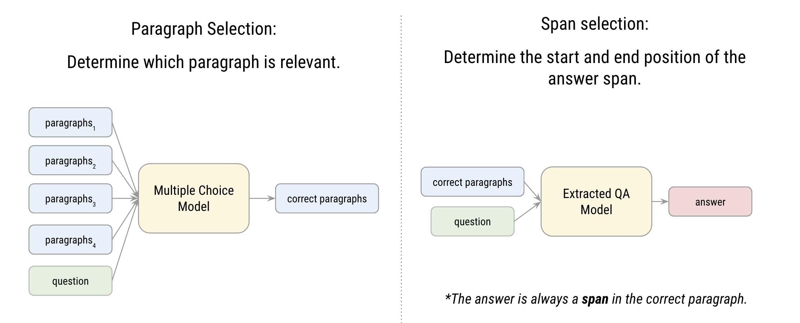

# Chinese Extractive Question Answering

This project aims to perform extractive question answering in Chinese.

<p align="center">
  
</p>

## **Prerequisites**

- Python 3.10.12

## **Repository Structure**

- **`download.sh`**: Script to install Python dependencies and download necessary files.
- **`requirements.txt`**: List of Python packages required for this project.
- **`download.py`**: Python script to download necessary files from Google Drive.
- **`run.sh`**: Bash script to run the inference code.
- **`main.py`**: Python script containing the inference code.

---

- **`train_src`**: Folder containing additional resources for training models on paragraph selection and span selection on your own.

---

- **`report.pdf`**: Explanations of the data processing and model selection.

## **Setup**

### **Step 1: Clone the Repository**

```bash
git clone https://github.com/your_username/Chinese-Extractive-QA.git
cd Chinese-Extractive-QA
```

### **Step 2: Install Dependencies**

Run the **`download.sh`** script to install the Python packages listed in **`requirements.txt`** and download the necessary files.

```bash
./download.sh
```

## **Run Inference**

To run the inference code, execute the **`run.sh`** script with the following arguments:

- **`${1}`**: Path to **`context.json`**
- **`${2}`**: Path to **`test.json`**
- **`${3}`**: Path to the output prediction file named **`prediction.csv`**

```bash
./run.sh /path/to/context.json /path/to/test.json /path/to/pred/prediction.csv
```

**Note**: Make sure to replace **`/path/to/context.json`**, **`/path/to/test.json`**, and **`/path/to/pred/prediction.csv`** with the actual paths to your files. To use the example code in this repo, you can run as below.

```bash
./run.sh ./ADL_HW1/datasets/context.json ./ADL_HW1/datasets/test.json ./prediction.csv
```

## Train Your Own Model

In notebooks `**paragraph_selection.ipynb**` and **`span_selection.ipynb`** , you can fine-tune existing models or train from scratch. These codes are modified from these sources:

- Paragraph Selection: [Transformers model](https://github.com/huggingface/transformers/blob/main/examples/pytorch/multiple-choice/README.md#multiple-choice) on a multiple choices dataset, like SWAG
- Span Selection: [Transformers model](https://github.com/huggingface/transformers/blob/main/examples/pytorch/question-answering/README.md) on a question-answering dataset, like SQuAD

## **License**

This project is licensed under the MIT License - see the [LICENSE.md](https://chat.openai.com/c/LICENSE.md) file for details.
